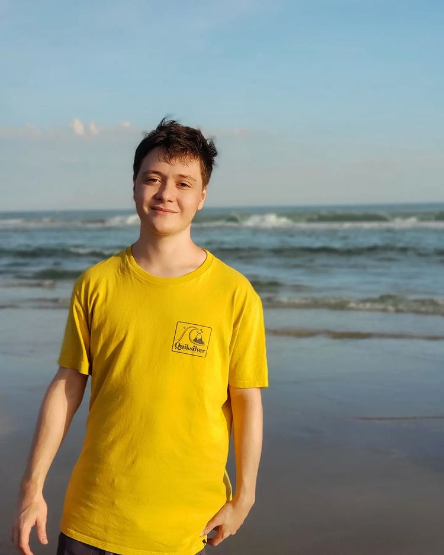

# Presentación

## Estudiante: Juan Pablo Castiglione

Seguí los pasos del doc [acá](https://docs.google.com/document/d/e/2PACX-1vQkogtG88cmwEIXEuff291urSyrZUYHikLIoRTspUodvIg5OoaUJTi8n0vqPJ3XUSN65sqJALTBizeB/pub).

### Descripción

¡Buenas! Mi nombre es Juan Pablo, me pueden decir Juampi, Juan o también algunos amigos me dicen JP (que se pronuncia *yeipi*). Tengo 20 años.
Desde chiquito siempre me interesaron mucho las computadoras y supe que iba a tirar para este lado y, aunque al final del secundario tuve mis dudas, finalmente estoy acá. 
Soy técnico en marketing y comunicación, y dentro de ese curso tuve una materia de programación (más específicamente programación web, es decir, lo básico de html, css y javascript). En esa materia me di cuenta que al final lo que más me interesaba era la programación, así que en el segundo año decidí anotarme en esta carrera simultáneamente. Ahora, que ya terminé la tecnicatura, me puedo enfocar en esta carrera al 100% y, como ya les mencioné, lo que más me gusta es la programación, así que tengo muchas ganas de cursar esta materia!

**Les deseo muchos éxitos para todos!**

JP.